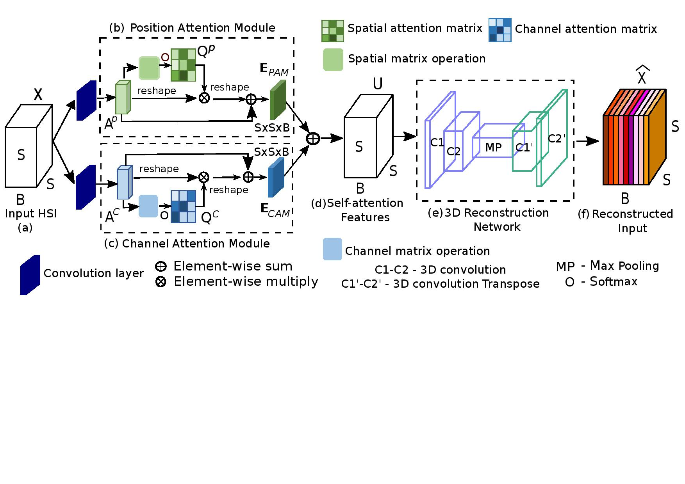

# DARecNet-BS
Pytorch Implementation of our paper **DARecNet-BS: Unsupervised Dual Attention  Reconstruction Network for  Hyperspectral Band Selection**

# Usage - SSRN Classification
- `git clone https://github.com/ucalyptus/DARecNet-BS.git`
- `cd DARecNet-BS/`
- `conda create -n dabsenv python=3.6`
- `conda activate dabsenv`
- `pip install -r requirements.txt`
- `cd SSRN/`
- `python indian.py` for Classification on Indian Pines Dataset.

# Usage - DARecNet-BS
Run the notebooks in the `DARecNet-BS/` directory using https://colab.research.google.com

# Architecture : DARecNet-BS

# Contact
Contact [Sayantan Das](mailto:sdas.codes@gmail.com) for code issues or file an issue at [this link](https://github.com/ucalyptus/DARecNet-BS/issues/new/choose)
