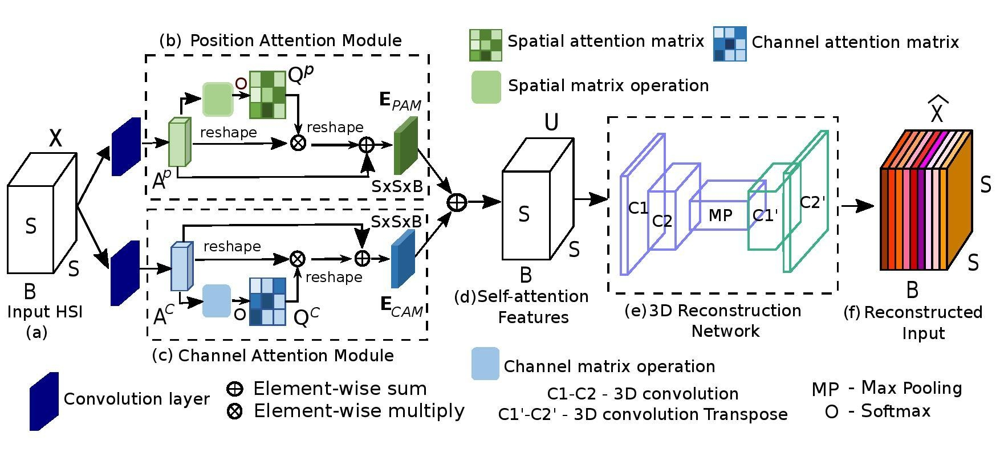

# DARecNet-BS
Pytorch Implementation of our paper [DARecNet-BS: Unsupervised Dual Attention  Reconstruction Network for  Hyperspectral Band Selection](https://ieeexplore.ieee.org/document/9164906/)

# Usage - SSRN Classification
- `git clone https://github.com/ucalyptus/DARecNet-BS.git`
- `cd DARecNet-BS/`
- `conda create -n dabsenv python=3.6`
- `conda activate dabsenv`
- `pip install -r requirements.txt`
- `cd SSRN/`
- `python indian.py` for Classification on Indian Pines Dataset.

See [SSRN Settings](https://github.com/ucalyptus/DARecNet-BS/blob/master/SSRN/settings.md) for details on SSRN settings.

# Usage - DARecNet-BS
Run the notebooks in the `DARecNet-BS/` directory using https://colab.research.google.com

# Architecture : DARecNet-BS

## Citation

If you use [DARecNet-BS](https://github.com/ucalyptus/DARecNet-BS) code in your research, we would appreciate a citation to the original paper:

	@article{roy2020bs,
		title={DARecNet-BS: Unsupervised Dual-Attention Reconstruction Network for Hyperspectral Band Selection},
		author={Roy, Swalpa Kumar and Das, Sayantan and Song, Tiecheng and Chanda, Bhabatosh},
		journal={IEEE Geoscience and Remote Sensing Letters},
		year={2020}
		}

# Contact
Contact [Sayantan Das](mailto:sdas.codes@gmail.com) for code issues or file an issue at [this link](https://github.com/ucalyptus/DARecNet-BS/issues/new/choose)

## Acknowledgement

Part of this code is from a implementation of Classification of HSI using CNN by [Zilong Zhong](https://github.com/zilongzhong/SSRN).

## License

Copyright (c) 2020 Sayantan Das. Released under the MIT License. See [LICENSE](LICENSE) for details.
